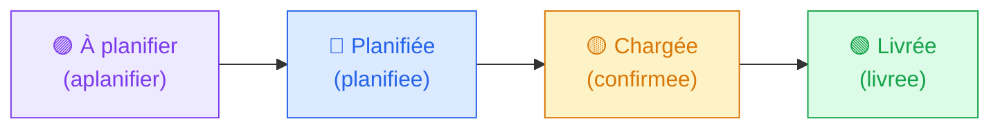
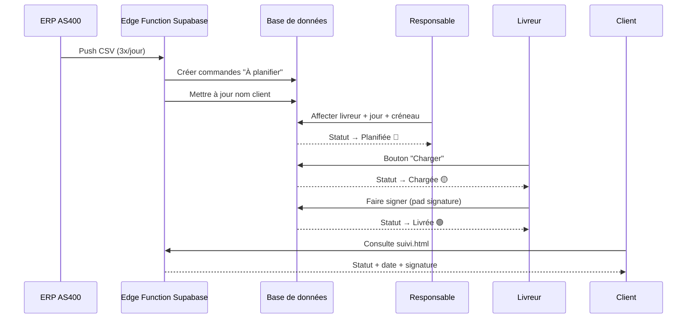
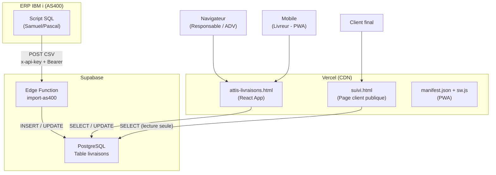
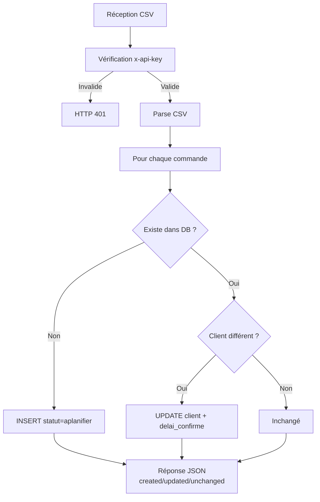

[README.md](https://github.com/user-attachments/files/30101453/README.md)
# 📦 Application de Suivi des Tournées — Attis

> Documentation Fonctionnelle et Technique  
> Rédigée le 16 juillet 2026

---

## Table des matières

1. [Présentation générale](#1-présentation-générale)
2. [Profils utilisateurs](#2-profils-utilisateurs)
3. [Cycle de vie d'une commande](#3-cycle-de-vie-dune-commande)
4. [Règles métier](#4-règles-métier)
5. [Architecture technique](#5-architecture-technique)
6. [Modèle de données](#6-modèle-de-données)
7. [Intégration AS400](#7-intégration-as400)
8. [Sécurité & Accès](#8-sécurité--accès)
9. [Déploiement](#9-déploiement)
10. [Roadmap & Améliorations futures](#10-roadmap--améliorations-futures)

---

## 1. Présentation générale

L'**Application de Suivi des Tournées** est un outil interne développé pour **Attis** (négoce en emballages Food Packaging) afin de digitaliser et centraliser la gestion des livraisons clients.

### Valeur ajoutée

- Visibilité en temps réel sur l'état de chaque commande
- Coordination entre les équipes ADV, les responsables de tournées et les livreurs
- Intégration automatique des commandes issues de l'ERP AS400 (IBM i)
- Preuve de livraison numérique via signature électronique
- Suivi client en libre-service via une URL publique dédiée
- Statistiques de performance et de ponctualité

### Cas d'usage principaux

| Cas d'usage | Acteur |
|---|---|
| Consulter l'agenda des livraisons de la semaine | ADV, Responsable |
| Affecter des commandes à un livreur | Responsable |
| Charger et livrer une tournée | Livreur |
| Faire signer le client à la livraison | Livreur |
| Rechercher le statut d'une commande | ADV, Responsable |
| Consulter l'état de sa commande | Client (via URL publique) |
| Analyser les performances de livraison | Responsable, ADV |

---

## 2. Profils utilisateurs

L'application distingue trois profils internes, chacun accédant via un code de connexion simple.

| Profil | Code | Onglets accessibles | Rôle |
|---|---|---|---|
| **ADV** | `ADV` | Agenda, Historique, Stats | Consultation et recherche |
| **Responsable des tournées** | `WICKY` | Agenda, Tournées, Livreur, Historique, Stats | Planification complète |
| **Livreur** | `ROUTE` | Livreur | Exécution de la tournée |

> ⚠️ Les codes de connexion sont partagés par groupe de rôle, pas individuels par personne.

### Livreurs configurés

`Manjula`, `George`, `Vladimir`, `Said`, `Houssem`, `Tyron`, `Extérieur`, `Autre`

---

## 3. Cycle de vie d'une commande

### Flux de statuts



### Parcours détaillé



### Description étape par étape

1. **Alimentation automatique** — L'ERP AS400 envoie un fichier CSV 3 fois par jour via un script automatisé. L'Edge Function Supabase crée les nouvelles commandes en statut *À planifier* et met à jour les noms clients sur les commandes existantes.

2. **Planification** — Le responsable des tournées consulte l'onglet **Agenda** ou **Tournées**, affecte chaque commande à un livreur, un jour et un créneau (Matin / Après-midi). Le statut passe à *Planifiée*.

3. **Préparation** — Un préparateur prépare physiquement les commandes (6 à 7 par tournée en moyenne).

4. **Chargement** — Le livreur ouvre l'onglet **Livreur**, sélectionne son nom, et clique sur **"📦 Charger"** pour chaque commande. Le statut passe à *Chargée*.

5. **Livraison** — Sur site client, le livreur clique sur **"✍️ Faire signer"** et capture la signature sur écran tactile. Le statut passe à *Livrée*, la date et l'heure exactes sont enregistrées.

6. **Consultation client** — Le client peut à tout moment consulter l'état de sa commande sur `https://attis-livraisons.vercel.app/suivi.html` en saisissant son numéro de commande. La signature est visible si la commande est livrée.

---

## 4. Règles métier

### Créneaux de livraison
- **Matin** ☀️
- **Après-midi** 🌙

### Agenda
- Affiche **J-2 à J+2** (jours ouvrés uniquement, lundi au vendredi)
- Filtre par jour et par livreur
- Drag & drop pour déplacer une commande d'un jour à l'autre
- Barre de recherche intégrée pour retrouver n'importe quelle commande

### Espace Livreur
- Le livreur ne voit **pas** les commandes *À planifier* (pas encore affectées)
- Le livreur ne voit **pas** les commandes déjà *Livrées*
- Le livreur peut faire signer une commande planifiée sur un jour futur (livraison anticipée)

### Transfert de programme
- Un responsable peut transférer en masse toutes les commandes d'un livreur sur un créneau/jour donné vers un autre livreur (utile en cas d'absence)

### Ponctualité
- Comparaison entre la **date confirmée AS400** (`delai_confirme`) et la **date réelle de livraison** (`livre_le`)
- Classement : Dans les temps / En retard / Jour J exact

---

## 5. Architecture technique

### Stack

| Couche | Technologie | Détail |
|---|---|---|
| **Frontend** | React 18 + Babel Standalone | Single HTML file, pas de build |
| **UI** | CSS custom (variables CSS) | Design system interne |
| **Hébergement** | Vercel | Déploiement automatique depuis GitHub |
| **Base de données** | Supabase (PostgreSQL) | Temps réel, Row Level Security activé |
| **Backend / API** | Supabase Edge Functions (Deno) | Fonction `import-as400` |
| **Source de données** | ERP AS400 / IBM i | Push CSV automatisé |
| **Export tableur** | SheetJS (xlsx) | Lecture des fichiers Excel côté client |

### Schéma d'architecture



---

## 6. Modèle de données

### Table `livraisons`

| Colonne | Type | Description |
|---|---|---|
| `id` | bigserial (PK) | Identifiant auto-incrémenté |
| `commande` | text (UNIQUE) | Numéro de commande AS400 |
| `jour` | text | Date de livraison planifiée (YYYY-MM-DD) |
| `creneau` | text | `Matin` ou `Après-midi` |
| `statut` | text | `aplanifier`, `planifiee`, `confirmee`, `livree` |
| `tournee` | text | Nom du livreur affecté |
| `client` | text | Nom de livraison (colonne G du CSV AS400) |
| `delai_confirme` | text | Date confirmée par l'AS400 (YYYY-MM-DD) |
| `signature` | text | Image base64 de la signature client |
| `livre_le` | timestamptz | Horodatage exact de la livraison |
| `created_at` | timestamptz | Date de création (auto) |

### Politiques de sécurité (RLS)

- **Lecture** : publique (SELECT autorisé sans authentification)
- **Écriture** : publique (INSERT/UPDATE autorisé — sécurité assurée par les codes de connexion applicatifs)

---

## 7. Intégration AS400

### Flux d'envoi

Le script IBM i (géré par Samuel/Pascal) envoie un fichier CSV 3 fois par jour vers l'endpoint Supabase.

### Endpoint

```
POST https://hkicyucebizazhqcvfht.supabase.co/functions/v1/import-as400
```

### Headers requis

```
x-api-key: attis-adsl-2026
Authorization: Bearer <anon_key_legacy>
Content-Type: text/plain
```

### Format CSV attendu

Une ligne = une commande. Colonnes (séparateur virgule) :

| Index | Colonne | Utilisé |
|---|---|---|
| 0 | Société | Non |
| 1 | Dépôt départ | Non |
| 2 | Agence | Non |
| 3 | **N° commande** | ✅ |
| 4 | N° client IBM | Non |
| 5 | Raison sociale | Non |
| 6 | **Nom livraison** | ✅ → `client` |
| 7-13 | Adresse, CP, Ville, Dates... | Non |
| 14 | **Délai confirmé** (AAAAMMJJ) | ✅ → `delai_confirme` |

### Comportement de la fonction



> Les erreurs de doublon (code `23505`) sont ignorées silencieusement.

### Réponse JSON

```json
{
  "success": true,
  "total": 1692,
  "created": 12,
  "updated": 45,
  "unchanged": 1635,
  "errors": []
}
```

---

## 8. Sécurité & Accès

### Authentification applicative

| Secret | Valeur | Usage |
|---|---|---|
| Codes de connexion | `ADV`, `WICKY`, `ROUTE` | Accès à l'interface |
| `IMPORT_SECRET_KEY` | `attis-adsl-2026` | Authentification du push AS400 |
| `SERVICE_ROLE_KEY` | (confidentiel Supabase) | Accès admin à la DB depuis l'Edge Function |

> ⚠️ Les secrets Supabase sont configurés dans **Supabase → Edge Functions → Secrets** et ne sont jamais exposés côté client.

### Contraintes Babel Standalone (important pour les développeurs)

Le frontend utilise Babel Standalone (sans build). Certaines syntaxes JavaScript modernes sont **interdites** :

- ❌ Optional chaining `?.`
- ❌ Nullish coalescing `??`
- ❌ Apostrophes françaises dans les strings JSX
- ❌ Template literals `${}` dans certains contextes JSX
- ❌ Regex avec saut de ligne littéral

---

## 9. Déploiement

### Structure du repository GitHub

```
attis-livraisons/          (repo: pierreelieserayet-collab/attis-livraisons)
├── attis-livraisons.html  ← Application principale (React)
├── suivi.html             ← Page de suivi client publique
├── manifest.json          ← PWA manifest
├── sw.js                  ← Service Worker PWA
├── icon-192.png           ← Icône PWA
├── icon-512.png           ← Icône PWA
└── docs/
    └── README.md          ← Cette documentation
```

### Procédure de mise à jour

1. Modifier le fichier `attis-livraisons.html` (ou autre fichier)
2. Sur GitHub : **Add file → Upload files → glisser le fichier → Commit**
3. Vercel redéploie automatiquement en 30 à 60 secondes

### URLs de production

| URL | Description |
|---|---|
| `https://attis-livraisons.vercel.app/attis-livraisons.html` | Application principale |
| `https://attis-livraisons.vercel.app/suivi.html` | Suivi commande client |

### Edge Function — mise à jour

1. Supabase Dashboard → **Edge Functions → import-as400 → Code**
2. Remplacer le code → **Deploy**

### Installation locale (optionnel)

Aucune installation requise. Ouvrir `attis-livraisons.html` dans un navigateur suffit pour tester l'interface (les appels Supabase fonctionnent depuis n'importe quel environnement).

---

## 10. Roadmap & Améliorations futures

| Priorité | Amélioration | Statut |
|---|---|---|
| 🔴 Haute | Ordre de livraison optimisé dans une tournée | À planifier |
| 🟡 Moyenne | Codes de connexion individuels par livreur | À planifier |
| 🟡 Moyenne | Notifications push quand une commande est livrée | À planifier |
| 🟢 Basse | Export PDF bon de livraison avec signature | À planifier |
| 🟢 Basse | Intégration GPS / cartographie des tournées | À planifier |

---

*Documentation générée avec l'aide de Claude (Anthropic) — Juillet 2026*
